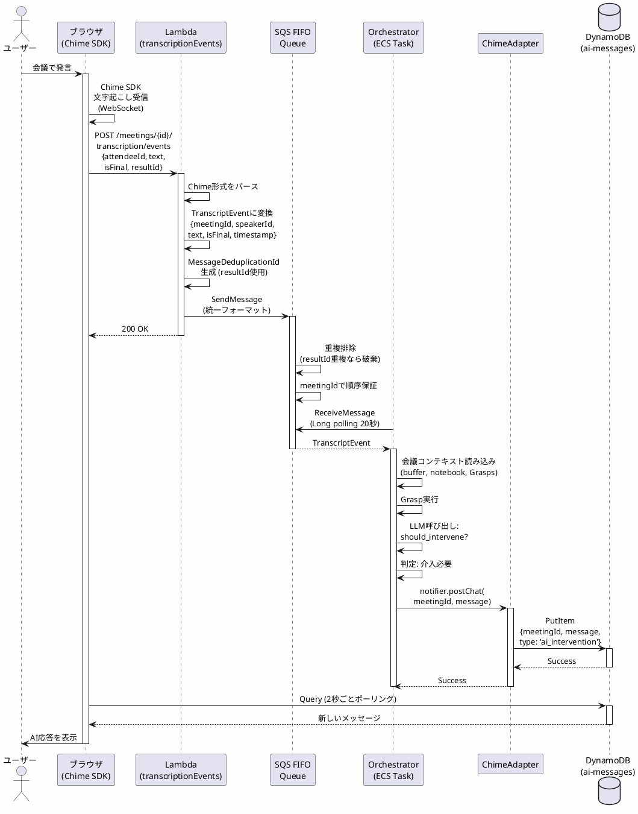
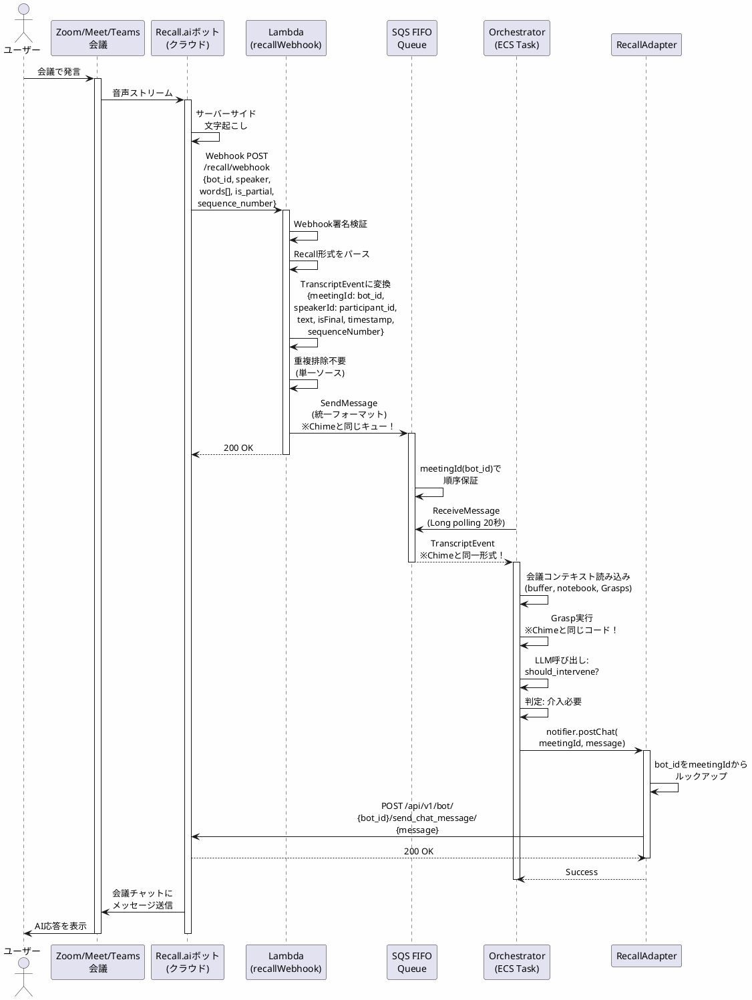

# ADR 0014: 会議サービス抽象化レイヤー（ランタイムアーキテクチャ）

- Status: Accepted
- Date: 2026-01-19
- Owners: timtam PoC チーム

## 背景 / Context

現在のシステムはAmazon Chime SDKに深く統合されているが、ADR 0009で決定されたようにサードパーティ会議サービス（Zoom、Google Meet、Microsoft Teamsなど）との統合が必要となった。

### 核心的な課題

**複数の会議サービスを単一のOrchestratorコードベースで処理するには？**

各サービスには異なる特性がある：
- **Chime SDK**: ブラウザベース、文字起こしはブラウザ経由、チャット送信はDynamoDB経由
- **Recall.ai**: サーバーサイドボット、Webhook経由の文字起こし、直接Chat API
- **将来のサービス**: MS Teams、Zoom等、それぞれ異なるAPI/SDK

### 設計方針の焦点

本ADRは**コード構成ではなく、ランタイムアーキテクチャ**に焦点を当てる：
1. **どのプロセスで何を処理するか**（Lambda vs ECS Orchestrator）
2. **サービス固有のロジックをどこに配置するか**
3. **統一フォーマットをどこで実現するか**

## 決定 / Decision

### 基本方針

1. **Lambdaプロセスでサービス固有のフォーマット変換を行う**
   - 入力：サービス固有フォーマット（Chime/Recall）
   - 出力：統一フォーマット（`TranscriptEvent`）

2. **SQS FIFOで統一フォーマットを維持**
   - すべてのサービスから同じキューに送信
   - Orchestratorはサービスの違いを意識しない

3. **Orchestratorは統一フォーマットのみを処理**
   - ビジネスロジック（Grasp実行、LLM呼び出し）に専念
   - プラットフォーム非依存

4. **Adapterでサービス固有の出力処理を行う**
   - Orchestrator内で利用する
   - サービス固有のAPI呼び出しをカプセル化

5. **共有ライブラリでサービス固有コードを集約**
   - pnpm workspaceを活用
   - Lambda、Orchestrator両方から利用

## アーキテクチャ / Architecture

### プロセストポロジー

```
┌──────────────────┐
│  会議サービス     │  ← ユーザーの会議（ブラウザまたはクラウド）
│  (Chime/Recall)  │
└────────┬─────────┘
         │
         ↓ HTTP/Webhook
┌──────────────────┐
│  Lambdaプロセス   │  ← AWS Lambda（サーバーレス、ステートレス）
│  (Serverless)    │  ← 短命（< 15分）
└────────┬─────────┘  ← 自動スケール
         │
         ↓ SQS FIFO
┌──────────────────┐
│  メッセージキュー │  ← デカップリング層
│  (SQS FIFO)      │  ← 順序保証・重複排除
└────────┬─────────┘
         │
         ↓ Long polling
┌──────────────────┐
│  Orchestrator    │  ← AWS ECS Task（長時間実行）
│  (ECS Task)      │  ← ステートフル（会議コンテキスト保持）
└────────┬─────────┘  ← 継続実行
         │
         ↓ API呼び出し
┌──────────────────┐
│  会議サービス     │  ← 応答を返送
│  (Chime/Recall)  │
└──────────────────┘
```

### 会議サービス特性比較

| 特性 | Chime SDK | Recall.ai | MS Teams Plugin (将来) |
|------|-----------|-----------|----------------------|
| **デプロイモデル** | ブラウザベース | サーバーサイドボット | ブラウザ拡張 |
| **文字起こしソース** | ブラウザSDK | Recall.aiサーバー | Teams SDK |
| **文字起こし配信** | ブラウザ → API | Webhook push | SDK callback |
| **話者識別** | attendeeId / externalUserId | participant_id (100%精度) | user_id |
| **出力メカニズム** | ブラウザがDynamoDBをポーリング | ボットがChat API送信 | Teams message API |
| **音声出力** | ブラウザが音声再生 | ボットが音声ストリーミング | N/A (テキストのみ?) |
| **コストモデル** | $0.102/時間（文字起こし） | $0.85/時間（ボット+文字起こし） | TBD |
| **リアルタイム性** | ~2秒レイテンシ | ~2-4秒レイテンシ | TBD |

### 主要な差異

#### 1. 文字起こし配信パターン

**Chime SDK（ブラウザからプル）:**
```
ブラウザ ← Chime SDK (WebSocket)
ブラウザ → POST /transcription/events → Lambda
```
- ブラウザがデータフローの**能動的参加者**
- ブラウザが開いて接続している必要あり
- 複数参加者の会議：各ブラウザが同じ文字起こしを送信（重複排除が必要）

**Recall.ai（サーバーからプッシュ）:**
```
Recall.aiボット → Webhook POST → Lambda
```
- ブラウザ依存なし
- 単一の真実のソース（ボット）
- 重複排除不要

#### 2. 出力メカニズム

**Chime SDK（DynamoDB経由で間接）:**
```
Orchestrator → DynamoDB.PutItem
ブラウザ ← DynamoDBを2秒ごとにポーリング
```
- メッセージ送信の直接APIなし
- ブラウザがアクティブである必要あり
- ポーリングによるレイテンシ

**Recall.ai（直接API）:**
```
Orchestrator → POST /bot/{id}/send_chat_message → 会議チャット
```
- 直接統合
- 即座の配信
- ブラウザ依存なし

### Fit & Gap分析

#### Orchestrator要件

Orchestratorが機能するために必要なもの：
1. **入力**: 一貫したフォーマットの文字起こしイベント
2. **コンテキスト**: 会議セッション状態（buffer、notebook、Grasps）
3. **出力**: 会議にメッセージを送信する能力
4. **セッション**: 状態を維持するための長時間実行プロセス

#### Chime SDKのギャップと解決策

| 要件 | Chime SDK能力 | ギャップ | 解決策 |
|------|---------------|---------|---------|
| 統一文字起こしフォーマット | Chime固有フォーマット提供 | ⚠️ フォーマット不一致 | **LambdaがTranscriptEventに変換** |
| 文字起こしの単一ソース | 各ブラウザが独立に送信 | ⚠️ 重複 | **Lambdaで重複排除（resultId/hash）** |
| 長時間実行セッション | ブラウザベース（ユーザーが離脱可能） | ⚠️ セッション不安定 | **Orchestratorがサーバーサイドセッション維持** |
| 会議にメッセージ送信 | 直接APIなし | ⚠️ Chat APIなし | **DynamoDB + ブラウザポーリング使用** |
| 話者識別 | attendeeIdまたはexternalUserId | ✅ 利用可能 | なし |

#### Recall.aiのギャップと解決策

| 要件 | Recall.ai能力 | ギャップ | 解決策 |
|------|---------------|---------|---------|
| 統一文字起こしフォーマット | Recall固有フォーマット提供 | ⚠️ フォーマット不一致 | **LambdaがTranscriptEventに変換** |
| 文字起こしの単一ソース | ボットが単一ソース | ✅ 重複なし | なし |
| 長時間実行セッション | ボットライフサイクル管理 | ✅ サーバーサイド | **OrchestratorがbotIdを追跡** |
| 会議にメッセージ送信 | Chat API利用可能 | ✅ 直接API | **POST /send_chat_message/呼び出し** |
| 話者識別 | participant_id（100%精度） | ✅ Chimeより優れる | なし |

### 統合ポイント分析

各統合ポイントで、以下を決定：
1. **統一可能か？** 可能なら、どこで統一すべきか？
2. **誰がサービス固有の詳細を知るべきか？** Lambda？Orchestrator？Adapter？
3. **どのランタイムプロセスが最適か？** ステートレスLambda vs ステートフルECS？

#### 統合ポイント1: 文字起こしイベントの受信

**サービス固有の側面:**
- Chime: ブラウザPOST（attendeeId、text、isFinal、resultId）
- Recall: Webhook POST（speaker.participant_id、words[]、is_partial、sequence_number）

**決定:**
- **どこで**: Lambdaプロセス
- **理由**:
  - ステートレス変換（コンテキスト不要）
  - HTTP/Webhookへの高速応答（< 100ms）
  - サービス固有コードをOrchestratorから分離
- **結果**: Orchestratorは統一`TranscriptEvent`を受信

```
プロセス境界: Lambda
├─ サービス固有: Chime/Recall形式をパース
├─ 統一: TranscriptEvent { meetingId, speakerId, text, isFinal, timestamp }
└─ 出力: SQSに書き込み
```

#### 統合ポイント2: 文字起こしの重複排除

**サービス固有の側面:**
- Chime: 複数ブラウザが同じ文字起こしを送信 → 重複排除必要（resultIdまたはhash）
- Recall: 単一ボット → 重複なし

**決定:**
- **どこで**: Lambdaプロセス
- **理由**:
  - サービスが重複排除が必要かを知っている
  - SQS FIFOのMessageDeduplicationIdが最適
  - Orchestratorへの不要な負荷を防ぐ
- **結果**: Orchestratorは重複排除済みイベントを受信

```
プロセス境界: Lambda
├─ サービス固有: ChimeはresultId使用、Recallは重複排除スキップ
├─ 統一: SQSのMessageDeduplicationId
└─ 出力: SQSで重複排除済みイベント
```

#### 統合ポイント3: 文字起こし処理（Graspロジック）

**サービス固有の側面:**
- **なし** - すべてのサービスがmeetingId、speakerId、textを提供

**決定:**
- **どこで**: Orchestratorプロセス（ECS）
- **理由**:
  - 会議コンテキスト必要（buffer、notebook、Grasps）
  - ステートフル処理（クールダウンタイマー、会話履歴）
  - LLM呼び出し（高コスト、リトライロジック必要）
- **結果**: プラットフォーム非依存のビジネスロジック

```
プロセス境界: Orchestrator (ECS)
├─ 統一: TranscriptEvent（サービス固有の知識なし）
├─ ビジネスロジック: Grasp実行、LLM呼び出し
└─ 出力: 介入するか否かの判断
```

#### 統合ポイント4: チャットメッセージ送信

**サービス固有の側面:**
- Chime: DynamoDBに書き込み → ブラウザがポーリング
- Recall: POST /api/v1/bot/{id}/send_chat_message/

**決定:**
- **どこで**: OrchestratorプロセスがAdapterを呼び出す
- **理由**:
  - Orchestratorが送信するメッセージを持つ
  - ランタイム判断（どのサービス？）
  - Adapterがサービス固有APIをカプセル化
- **結果**: サービス固有API呼び出しがAdapterインターフェースの背後に隠蔽

```
プロセス境界: Orchestrator (ECS)
├─ 統一: notifier.postChat(meetingId, message)
├─ サービス固有（Adapter）:
│   ├─ ChimeAdapter → DynamoDB.PutItem
│   └─ RecallAdapter → fetch(Recall API)
└─ 出力: 会議にメッセージ配信
```

#### 統合ポイント5: 参加者イベント（将来/TBD）

**サービス固有の側面:**
- Chime: ブラウザSDKイベント（join/leave/mute）
- Recall: Webhookイベント（participant.join、participant.leave）

**決定（暫定）:**
- **どこで**: Lambdaプロセス → SQSまたはDynamoDB（TBD）
- **理由**:
  - 文字起こしイベントと類似（サービス固有フォーマット）
  - リアルタイム（SQS）vs 必要時クエリ（DynamoDB）を決定する必要
- **結果**: ユースケースに基づきTBD

### データフロー：ランタイムシーケンス図

#### Chime SDKフロー



#### Recall.aiフロー



### プロセス別責務

#### Lambdaプロセス（ステートレス、短命）

**実行内容:**
- HTTP/Webhookハンドラー
- サービス固有フォーマット変換
- 重複排除ロジック
- SQS/DynamoDBへの書き込み

**Lambdaを選ぶ理由:**
- ✅ リクエスト量に応じた自動スケール
- ✅ 維持する状態なし
- ✅ コールドスタート許容可能（< 1秒）
- ✅ バースト的なトラフィックでコスト効率良い
- ✅ 組み込みリトライ/エラーハンドリング

**サービス固有コード:**
- ✅ あり - Lambdaは処理するサービスを知っている
- ✅ 最小限のロジック：パース、変換、書き込み

**例:**
```
transcriptionEvents.ts → Chime SDK文字起こしを処理
recallWebhook.ts       → Recall.ai Webhookを処理
teamsWebhook.ts        → 将来: Teams文字起こしを処理
```

#### Orchestratorプロセス（ステートフル、長時間実行）

**実行内容:**
- 会議セッション管理
- 文字起こしバッファ（会話履歴）
- Notebook（Grasp出力）
- Grasp実行
- LLM呼び出し
- 意思決定（介入するか否か）
- Adapter経由でメッセージ送信

**ECSを選ぶ理由:**
- ✅ 長時間実行（数時間）
- ✅ メモリ内で状態を維持
- ✅ 継続的SQSポーリング（コールドスタートなし）
- ✅ 複雑なビジネスロジック
- ✅ 予測可能なコスト（予約キャパシティ）

**サービス固有コード:**
- ❌ 直接のサービス知識なし
- ✅ 出力にAdapterインターフェースを使用
- ✅ プラットフォーム非依存の`TranscriptEvent`入力

**例:**
```
worker.ts           → SQSをポーリング、統一イベントを処理
OrchestratorManager → 複数会議を管理
Grasp               → ビジネスロジック（サービス知識なし）
```

## 実装 / Implementation

### 共有ライブラリ構成

```
timtam/
├── pnpm-workspace.yaml
├── packages/
│   └── shared/
│       ├── package.json  # "@timtam/shared"
│       ├── tsconfig.json
│       └── src/
│           ├── types/
│           │   ├── events.ts           # TranscriptEvent, ParticipantEvent
│           │   └── meeting.ts          # MeetingInfo
│           ├── adapters/
│           │   ├── MeetingServiceAdapter.ts  # インターフェース
│           │   ├── ChimeAdapter.ts           # Chime実装
│           │   └── RecallAdapter.ts          # Recall実装
│           └── index.ts
└── services/
    ├── orchestrator/
    │   ├── package.json  # depends on "@timtam/shared": "workspace:*"
    │   └── worker.ts     # import { ChimeAdapter } from '@timtam/shared'
    └── meeting-api/
        ├── package.json  # depends on "@timtam/shared": "workspace:*"
        ├── transcriptionEvents.ts  # TranscriptEvent型を使用
        └── recallWebhook.ts        # NEW: TranscriptEvent型を使用
```

### MeetingServiceAdapterインターフェース

```typescript
// packages/shared/src/adapters/MeetingServiceAdapter.ts

export interface MeetingServiceAdapter {
  // ========================================
  // INBOUND: サービス形式 → 統一形式に変換
  // ========================================

  /**
   * サービス固有の文字起こし形式を統一TranscriptEventに変換
   * Lambda関数から呼ばれる
   */
  processInboundTranscript(payload: any): TranscriptEvent;

  /**
   * サービス固有の参加者イベントを統一ParticipantEventに変換（TBD）
   * Lambda関数から呼ばれる
   */
  processInboundParticipantEvent?(payload: any): ParticipantEvent;

  // ========================================
  // OUTBOUND: サービス固有エンドポイントに送信
  // ========================================

  /**
   * 会議サービスにチャットメッセージを送信
   * Orchestratorから呼ばれる
   */
  postChat(meetingId: MeetingId, message: string): Promise<void>;

  /**
   * デバッグ/監査用にLLM呼び出しをログ
   * Orchestratorから呼ばれる
   */
  postLlmCallLog(meetingId: MeetingId, prompt: string, rawResponse: string, nodeId?: string): Promise<void>;

  /**
   * 会議に音声出力を送信（将来）
   * Orchestratorから呼ばれる
   */
  postAudio?(meetingId: MeetingId, audioData: Buffer): Promise<void>;
}
```

### Lambda実装例

```typescript
// services/meeting-api/transcriptionEvents.ts
import { ChimeAdapter } from '@timtam/shared';

export const handler: APIGatewayProxyHandlerV2 = async (event) => {
  const adapter = new ChimeAdapter();

  // AdapterがChime固有形式 → TranscriptEventに変換
  const transcriptEvent = adapter.processInboundTranscript(event.body);

  // Lambda統一形式をSQSに書き込み
  await sqs.send(new SendMessageCommand({
    QueueUrl: TRANSCRIPT_QUEUE_URL,
    MessageBody: JSON.stringify(transcriptEvent),
  }));

  return { statusCode: 200, body: JSON.stringify({ ok: true }) };
};
```

```typescript
// services/meeting-api/recallWebhook.ts (NEW)
import { RecallAdapter } from '@timtam/shared';

export const handler: APIGatewayProxyHandlerV2 = async (event) => {
  const adapter = new RecallAdapter();

  // AdapterがRecall固有形式 → TranscriptEventに変換
  const transcriptEvent = adapter.processInboundTranscript(event.body);

  // Lambda統一形式をSQSに書き込み（Chimeと同じキュー！）
  await sqs.send(new SendMessageCommand({
    QueueUrl: TRANSCRIPT_QUEUE_URL,
    MessageBody: JSON.stringify(transcriptEvent),
  }));

  return { statusCode: 200, body: JSON.stringify({ ok: true }) };
};
```

### Orchestrator実装例

```typescript
// services/orchestrator/worker.ts
import { ChimeAdapter, RecallAdapter } from '@timtam/shared';

// 環境変数に基づいてAdapterを選択
const notifier = process.env.MEETING_PLATFORM === 'recall'
  ? new RecallAdapter({ apiKey: RECALL_API_KEY })
  : new ChimeAdapter({ aiMessagesTable: AI_MESSAGES_TABLE });

// SQSをポーリング（統一フォーマット）
const result = await sqs.send(new ReceiveMessageCommand({
  QueueUrl: TRANSCRIPT_QUEUE_URL,
  MaxNumberOfMessages: 10,
  WaitTimeSeconds: 20,
}));

// 統一フォーマットを処理
for (const message of result.Messages || []) {
  const event: TranscriptEvent = JSON.parse(message.Body);
  await orchestratorManager.processTranscriptEvent(event, notifier, metrics);
}
```

## 影響 / Consequences

### ポジティブ

1. **明確な責務分離**
   - ✅ Lambda：サービス固有のフォーマット変換
   - ✅ SQS：統一フォーマットの維持
   - ✅ Orchestrator：プラットフォーム非依存のビジネスロジック

2. **新サービス追加が容易**
   - ✅ 新しいLambda関数を追加
   - ✅ 新しいAdapter実装を追加
   - ✅ Orchestratorコードは変更不要

3. **テスタビリティ向上**
   - ✅ Adapterをモック化してOrchestratorをテスト
   - ✅ Lambda関数を独立してテスト
   - ✅ 統一フォーマットでE2Eテスト

4. **スケーラビリティ**
   - ✅ Lambda：自動スケール（トラフィック増加に対応）
   - ✅ SQS：バッファリングとデカップリング
   - ✅ Orchestrator：水平スケール可能（MessageGroupIdシャーディング）

5. **単一コードベース**
   - ✅ Graspロジックはすべてのサービスで共有
   - ✅ LLM統合は一度実装
   - ✅ バグ修正がすべてのプラットフォームに適用

### ネガティブ

1. **複雑性の増加**
   - ⚠️ 複数プロセスとインターフェース
   - ⚠️ 学習曲線（新しい開発者向け）
   - **軽減策**: 明確なドキュメント、シーケンス図

2. **デバッグの困難性**
   - ⚠️ 複数プロセス間のトレース
   - **軽減策**: CloudWatch Logs、X-Ray トレーシング、相関ID

3. **遅延の追加**
   - ⚠️ Lambda → SQS → Orchestrator（追加のホップ）
   - **軽減策**: SQS long polling、最適化されたLambda

4. **共有ライブラリの管理**
   - ⚠️ バージョン管理、依存関係
   - **軽減策**: pnpm workspace、明確なセマンティックバージョニング

### リスク軽減策

1. **段階的移行**
   - Phase 1: 既存Chime SDKをAdapterにリファクタリング
   - Phase 2: Recall.ai統合を追加
   - Phase 3: 追加サービス

2. **包括的テスト**
   - 単体テスト: Adapter実装
   - 統合テスト: Lambda → SQS → Orchestrator
   - E2Eテスト: 実際の会議シナリオ

3. **モニタリング**
   - CloudWatch メトリクス: Lambda実行時間、SQSキュー深度
   - X-Ray トレーシング: エンドツーエンドのレイテンシ
   - アラート: エラー率、処理時間

## 未決事項 / TBD

1. **参加者イベントの保存方法**
   - SQS（リアルタイム処理）vs DynamoDB（必要時クエリ）
   - Orchestratorでリアルタイム参加者追跡が必要か？

2. **会議ライフサイクル管理**
   - `join()`/`leave()`はAdapterに含めるか、別Lambda APIか
   - 現在の考え：一貫性のためLambda APIに保持

3. **エラーハンドリング**
   - Adapterが変換エラーをどう報告すべきか？
   - 例外をスロー？`Result<T, E>`を返す？

4. **Adapter初期化**
   - 遅延初期化 vs 即座？
   - Recall.ai API用の接続プーリング？

## 参考 / References

### 関連ADR
- [ADR 0009: サードパーティ会議サービス統合アーキテクチャ](./0009-third-party-meeting-service-integration.md)
- [ADR 0011: SQS FIFO移行](./0011-sqs-fifo-migration.md)
- [ADR 0007: Orchestratorとブラウザの連携](./0007-orchestrator-browser-coordination.md)

### 関連ファイル
- `services/orchestrator/worker.ts` - Orchestratorメインループ
- `services/meeting-api/transcriptionEvents.ts` - Chime SDK Lambda
- `packages/shared/src/adapters/` - 共有Adapter実装

### 外部ドキュメント
- [Recall.ai Documentation](https://docs.recall.ai/)
- [AWS Lambda Best Practices](https://docs.aws.amazon.com/lambda/latest/dg/best-practices.html)
- [pnpm Workspace](https://pnpm.io/workspaces)
