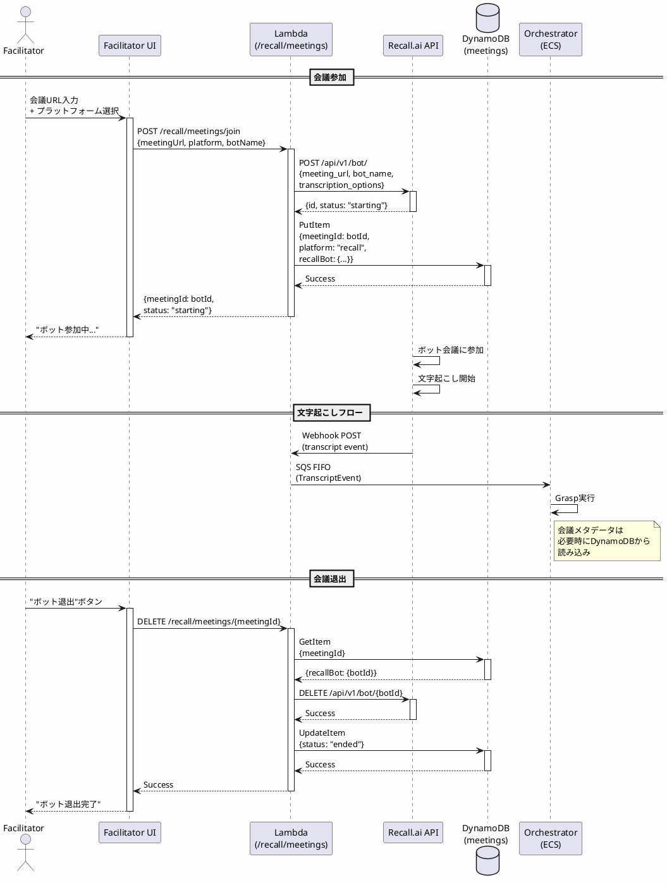
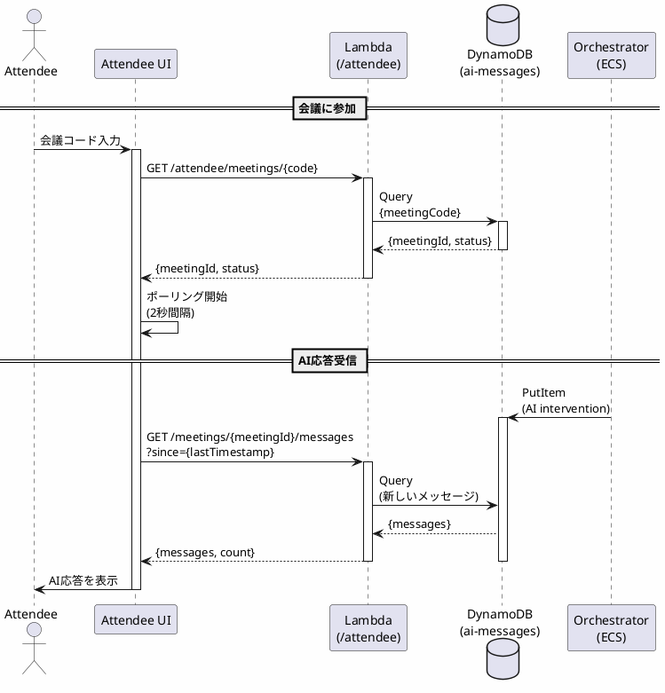

# ADR 0015: 会議ライフサイクル管理とUI設計

- Status: Accepted
- Date: 2026-01-19
- Owners: timtam PoC チーム

## 背景 / Context

ADR 0014でランタイムアーキテクチャを定義したが、会議ライフサイクル管理とUI設計については深く掘り下げなかった。Chime SDKとRecall.aiでは会議の作成・参加・退出のモデルが根本的に異なり、これがUI設計に大きな影響を与える。

### 会議モデルの違い

#### Chime SDK（現在）

```
1. システムが会議を作成
2. ブラウザが会議に参加（WebRTC）
3. ブラウザが文字起こしを受信・送信
4. ブラウザがAI応答を表示
```

- **特徴**: ブラウザが主体、会議作成から参加まで一貫
- **制約**: ユーザーがブラウザを開いている必要あり

#### Recall.ai（計画中）

```
1. ユーザーが外部で会議を作成（Zoom/Meet/Teams）
2. システムがボットを会議に参加させる
3. ボットが文字起こしを受信・送信
4. 別のUIでAI応答を表示
```

- **特徴**: ボットが主体、会議とUIが分離
- **利点**: ブラウザ不要、既存会議に統合可能

### ユーザーの役割

さらに重要なのは、**ユーザーの役割が2つある**ことが判明した：

1. **Facilitator（ファシリテーター/管理者）**
   - 会議にボットを参加させる
   - Grasp設定を調整
   - LLM応答を詳細にモニタリング
   - 手動介入を実行

2. **Attendee（参加者）**
   - AI応答を受信するだけ
   - 会議により良く参加するための情報を得る
   - 最小限のインタラクション

### 核心的な課題

1. **会議ライフサイクル管理**: 誰が会議作成・参加・退出を処理するか？
2. **メタデータ管理**: DynamoDBスキーマをどう設計するか？
3. **UI設計**: Facilitator/Attendeeの異なるニーズをどう満たすか？
4. **状態同期**: Orchestratorは会議状態をどう知るか？

## 決定 / Decision

### 1. 会議ライフサイクル管理: Lambda API

**決定:**
- 会議の作成・参加・退出はLambda APIが処理
- DynamoDBに会議メタデータを保存
- Orchestratorは文字起こしイベントから会議を自動認識

**理由:**
- ✅ ステートレス、シンプル
- ✅ 既存Chime APIと一貫性
- ✅ WebUIから直接呼び出し可能
- ✅ ADR 0014のランタイム分離原則に沿う

### 2. Recall.ai統合方式: 既存会議URL

**決定:**
- ユーザーが外部で作成した会議URL（Zoom/Meet/Teams）を提供
- システムがRecall.ai botを作成・参加

**理由:**
- ✅ シンプル（Zoom/Meet OAuth統合不要）
- ✅ 柔軟（どの会議サービスでも利用可能）
- ✅ ユーザーが会議設定を完全に制御

**代替案（却下）:**
- システムがZoom/Meet APIで会議を作成
  - ❌ OAuth統合の複雑さ
  - ❌ プラットフォームごとのAPI実装
  - ❌ ユーザーの自由度低下

### 3. WebUI設計: 2つの役割、2つのUI

**決定:**
- **Facilitator UI**: 管理者向け、フル機能
- **Attendee UI**: 参加者向け、情報受信のみ
- 既存Chime WebUI（timtam-web）は削除済み（2026-02-08）

**理由:**
- ✅ 役割に応じた最適UX
- ✅ Facilitatorは詳細制御、Attendeeはシンプル
- ✅ セキュリティ分離（Grasp設定はFacilitatorのみ）
- ✅ スケーラビリティ（多数のAttendee）

### 4. DynamoDBスキーマ: クリーンな新設計

**決定:**
- プラットフォーム固有フィールドを明示的に分離
- 後方互換性は考慮しない（PoCなので既存データ破棄可能）

**理由:**
- ✅ 明確な設計
- ✅ 拡張性（新プラットフォーム追加容易）
- ✅ PoCフェーズの柔軟性

### 5. リアルタイム更新方式: ポーリング over SSE

**決定:**
- Facilitator UIは2秒間隔のHTTPポーリングで更新
- `GET /meetings/{meetingId}/messages?since={timestamp}&limit={limit}`
- SSE（Server-Sent Events）は使用しない

**理由:**
- ✅ **実装がシンプル**: 既存GET APIを再利用、新Lambda関数不要
- ✅ **低コスト**: Lambda実行時間が短い（SSEは接続維持で課金）
- ✅ **インフラ変更最小**: API Gateway設定変更不要
- ✅ **エラーハンドリング容易**: 接続切断リスクなし、リトライが簡単
- ✅ **デバッグ容易**: 通常のHTTPリクエストなのでブラウザDevToolsで確認可能

**トレードオフ:**
- ⚠️ **2秒の遅延**: 完全なリアルタイムではない
  - **許容理由**: Facilitator UIの用途（監視・デバッグ）では2秒遅延は問題なし
- ⚠️ **ポーリングコスト**: 2秒ごとにLambda実行
  - **コスト影響**: 1時間会議で約1800リクエスト、約$0.0002（無視できるレベル）

**代替案（却下）:**
- **SSE（Server-Sent Events）**
  - ❌ Lambda実行時間課金（接続維持で高コスト）
  - ❌ API Gateway設定が複雑（統合レスポンス設定）
  - ❌ 新Lambda関数が必要
  - ⚠️ 利点: リアルタイム性が高い（数百ms）
  - **判断**: PoCフェーズではコストとシンプルさを優先

**実装詳細:**
```typescript
// Frontend: 2秒ごとにポーリング
useEffect(() => {
  let lastTimestamp = 0;

  const pollMessages = async () => {
    const response = await fetch(
      `${apiUrl}/meetings/${meetingId}/messages?since=${lastTimestamp}&limit=100`
    );
    const data = await response.json();

    // メッセージをtype別に分類（transcript/ai_intervention/llm_call）
    data.messages.forEach((msg) => {
      // State更新...
    });

    // 最新タイムスタンプを更新（次回は増分取得）
    if (data.messages.length > 0) {
      lastTimestamp = Math.max(...data.messages.map(m => m.timestamp));
    }
  };

  pollMessages(); // 初回取得
  const interval = setInterval(pollMessages, 2000); // 2秒ごと

  return () => clearInterval(interval);
}, [meetingId]);
```

**将来の改善案（Phase 2）:**
- ユーザーフィードバックに基づきポーリング間隔を調整（1秒 or 3秒）
- 高頻度更新が必要な場合はSSE実装を検討
- WebSocket実装（双方向通信が必要な場合）

## アーキテクチャ / Architecture

### 会議ライフサイクル（Recall.ai）



### Attendeeフロー



### DynamoDBスキーマ

#### 会議メタデータテーブル

```typescript
// Table: meetings-metadata
{
  // 共通フィールド
  meetingId: string,              // PK: Chime=meetingId, Recall=botId
  platform: "chime" | "recall",   // プラットフォーム識別
  status: "active" | "ended",     // 会議状態
  createdAt: number,              // 作成日時（epoch ms）
  endedAt?: number,               // 終了日時（epoch ms）

  // Attendee参加用
  meetingCode?: string,           // GSI: Attendeeがアクセスするための短いコード

  // Chime固有フィールド（platform="chime"の場合のみ）
  chimeMeeting?: {
    MeetingId: string,
    ExternalMeetingId: string,
    MediaRegion: string,
    MediaPlacement: {
      AudioHostUrl: string,
      SignalingUrl: string,
      // ...
    }
  },
  chimeAttendee?: {
    AttendeeId: string,
    ExternalUserId: string,
    JoinToken: string
  },

  // Recall固有フィールド（platform="recall"の場合のみ）
  recallBot?: {
    botId: string,                // Recall.ai bot ID
    meetingUrl: string,           // 元の会議URL
    platform: "zoom" | "google_meet" | "teams" | "webex",
    botName: string,              // ボット表示名
    status: "starting" | "in_meeting" | "done" | "error",
    statusMessage?: string        // エラー詳細等
  }
}

// GSI: meetingCode-index
// PK: meetingCode
// 用途: AttendeeがコードでmeetingIdを取得
```

#### AI応答テーブル（拡張）

```typescript
// Table: ai-messages
{
  meetingId: string,              // PK
  timestamp: number,              // SK (Range Key)
  message: string,                // メッセージ内容（JSONまたはテキスト）
  type: "transcript" | "ai_intervention" | "llm_call",
  ttl: number,                    // 24時間後に自動削除

  // type="transcript"の場合、messageはJSON文字列:
  // { speakerId: string, text: string, isFinal: boolean }

  // type="llm_call"の場合、messageはJSON文字列:
  // { nodeId: string, prompt: string, rawResponse: string }

  // type="ai_intervention"の場合、messageはプレーンテキスト
}
```

**変更履歴:**
- 2026-01-23: `type: "transcript"`を追加（Facilitator UI監視機能のため）
- Final transcript（isFinal=true）のみ保存、TTL 24時間

### WebUI構成

```
web/
├── facilitator/                 # NEW: Facilitator UI
│   ├── app/
│   │   ├── page.tsx            # ダッシュボード
│   │   ├── meetings/
│   │   │   ├── join/           # 会議参加フォーム
│   │   │   └── [id]/           # 会議詳細・モニタリング
│   │   ├── config/             # Grasp設定
│   │   └── logs/               # LLMログビューア
│   ├── components/
│   │   ├── BotManager/         # ボット参加/退出
│   │   ├── TranscriptViewer/   # リアルタイム文字起こし
│   │   ├── GraspEditor/        # YAML編集（Monaco Editor）
│   │   └── LLMLogViewer/       # Prompt/Response表示
│   └── package.json
│
├── attendee/                    # NEW: Attendee UI
│   ├── app/
│   │   ├── page.tsx            # 会議コード入力
│   │   └── meetings/
│   │       └── [id]/           # AI応答表示
│   ├── components/
│   │   ├── JoinForm/           # 会議コード入力
│   │   └── MessageViewer/      # AI応答表示（シンプル）
│   └── package.json
│
└── timtam-web/                  # 既存: Chime SDK実験用
    └── ...                      # 将来的にfacilitatorに統合または廃止
```

### API設計

#### Facilitator向けAPI

```typescript
// 会議参加
POST /recall/meetings/join
Request: {
  meetingUrl: string,           // Zoom/Meet/Teams URL
  platform: "zoom" | "google_meet" | "teams" | "webex",
  botName?: string              // デフォルト: "Timtam AI"
}
Response: {
  meetingId: string,            // botId
  meetingCode: string,          // Attendee用の短いコード
  status: "starting"
}

// 会議状態取得
GET /recall/meetings/{meetingId}
Response: {
  meetingId: string,
  platform: "recall",
  status: "active" | "ended",
  recallBot: {
    botId: string,
    meetingUrl: string,
    platform: "zoom",
    status: "in_meeting"
  }
}

// 会議退出
DELETE /recall/meetings/{meetingId}
Response: {
  success: true
}

// Grasp設定取得/更新（既存API再利用）
GET /config/grasp
PUT /config/grasp
```

#### Attendee向けAPI

```typescript
// 会議コードでmeetingId取得
GET /attendee/meetings/{code}
Response: {
  meetingId: string,
  status: "active" | "ended"
}

// AI応答取得（ポーリング）
GET /meetings/{meetingId}/messages?since={timestamp}&limit={limit}
Response: {
  meetingId: string,
  messages: [
    {
      timestamp: number,
      message: string,
      type: "transcript" | "ai_intervention" | "llm_call"
    }
  ],
  count: number
}

// 注: Facilitator UIと同じエンドポイントを使用
// AttendeeはAI応答のみ表示、Facilitatorは全データ表示
```

## Facilitator UI機能詳細

### 1. ボット管理

**会議参加画面:**
```
┌─────────────────────────────────────────┐
│ ボットを会議に参加させる                  │
├─────────────────────────────────────────┤
│                                         │
│ 会議URL                                  │
│ ┌─────────────────────────────────────┐ │
│ │ https://zoom.us/j/123456789        │ │
│ └─────────────────────────────────────┘ │
│                                         │
│ プラットフォーム                         │
│ ◉ Zoom   ○ Google Meet   ○ Teams      │
│                                         │
│ ボット名（オプション）                    │
│ ┌─────────────────────────────────────┐ │
│ │ Timtam AI                          │ │
│ └─────────────────────────────────────┘ │
│                                         │
│         [ ボットを参加させる ]           │
│                                         │
└─────────────────────────────────────────┘
```

**会議モニタリング画面:**
```
┌─────────────────────────────────────────┐
│ Meeting ID: bot-abc123                  │
│ Status: ● In Meeting  | Code: XYZ789   │
├─────────────────────────────────────────┤
│ [ 文字起こし ] [ AI応答 ] [ ログ ]     │
├─────────────────────────────────────────┤
│ リアルタイム文字起こし:                  │
│ ┌─────────────────────────────────────┐ │
│ │ [10:23] 田中: 今日の議題は...       │ │
│ │ [10:24] 佐藤: それについては...     │ │
│ │                                     │ │
│ └─────────────────────────────────────┘ │
│                                         │
│ AI介入:                                 │
│ ┌─────────────────────────────────────┐ │
│ │ [10:25] Grasp: silence-monitor      │ │
│ │ ✓ 介入実行                          │ │
│ │ "議論が停滞しているようです..."      │ │
│ └─────────────────────────────────────┘ │
│                                         │
│         [ ボット退出 ]  [ 手動介入 ]    │
└─────────────────────────────────────────┘
```

### 2. Grasp設定

**YAML編集画面:**
```
┌─────────────────────────────────────────┐
│ Grasp設定                               │
├─────────────────────────────────────────┤
│ ┌─────────────────────────────────────┐ │
│ │ grasps:                             │ │
│ │   - nodeId: silence-monitor         │ │
│ │     promptTemplate: |               │ │
│ │       {{INPUT:past5m}}で沈黙が...   │ │
│ │     intervalSec: 30                 │ │
│ │     outputHandler: chat             │ │
│ │                                     │ │
│ │   - nodeId: topic-summary           │ │
│ │     ...                             │ │
│ └─────────────────────────────────────┘ │
│                                         │
│   [ キャンセル ]  [ 保存して適用 ]      │
└─────────────────────────────────────────┘
```

### 3. 詳細モニタリング

**LLMログビューア:**
```
┌─────────────────────────────────────────┐
│ LLM呼び出しログ                          │
├─────────────────────────────────────────┤
│ [10:25:34] Grasp: silence-monitor       │
│                                         │
│ Prompt (300 chars):                     │
│ ┌─────────────────────────────────────┐ │
│ │ 以下の会議文字起こしで沈黙が...      │ │
│ │ [10:20] 田中: ...                   │ │
│ └─────────────────────────────────────┘ │
│                                         │
│ Response (150 chars):                   │
│ ┌─────────────────────────────────────┐ │
│ │ {                                   │ │
│ │   "should_intervene": true,         │ │
│ │   "reason": "30秒以上の沈黙",        │ │
│ │   "message": "議論が停滞..."        │ │
│ │ }                                   │ │
│ └─────────────────────────────────────┘ │
│                                         │
│ Latency: 1.2s | Cost: $0.003           │
└─────────────────────────────────────────┘
```

## Attendee UI機能詳細

### シンプルな情報表示

```
┌─────────────────────────────────────────┐
│ Timtam AI - 会議アシスタント             │
├─────────────────────────────────────────┤
│ 会議コードを入力してください              │
│ ┌─────────────────────────────────────┐ │
│ │ XYZ789                              │ │
│ └─────────────────────────────────────┘ │
│         [ 参加 ]                        │
└─────────────────────────────────────────┘

↓ 参加後

┌─────────────────────────────────────────┐
│ Meeting Code: XYZ789                    │
│ Status: ● Active                        │
├─────────────────────────────────────────┤
│ AI からのメッセージ:                     │
│                                         │
│ ┌─────────────────────────────────────┐ │
│ │ 10:25                               │ │
│ │ 議論が停滞しているようです。次の     │ │
│ │ アクションアイテムを確認しましょう。  │ │
│ └─────────────────────────────────────┘ │
│                                         │
│ ┌─────────────────────────────────────┐ │
│ │ 10:28                               │ │
│ │ 重要なポイント: プロジェクト期限は   │ │
│ │ 来週金曜日です。                     │ │
│ └─────────────────────────────────────┘ │
│                                         │
└─────────────────────────────────────────┘
```

## 実装 / Implementation

### Phase 2: Lambda API & インフラ

1. **Lambda関数**
   - `POST /recall/meetings/join` - ボット参加
   - `GET /recall/meetings/{meetingId}` - 状態取得
   - `DELETE /recall/meetings/{meetingId}` - ボット退出
   - `GET /attendee/meetings/{code}` - コードでmeetingId取得
   - `GET /meetings/{meetingId}/messages` - メッセージ取得（ポーリング用、既存API）

2. **DynamoDB**
   - `meetings-metadata`テーブル作成
   - `meetingCode`用GSI作成
   - 既存`ai-messages`テーブルはそのまま利用

3. **インフラ（CDK）**
   - API Gateway routes
   - Lambda関数デプロイ
   - DynamoDB作成・権限

### Phase 3: Facilitator UI

1. **プロジェクトセットアップ**
   ```bash
   cd web
   npx create-next-app@latest facilitator --typescript --tailwind --app
   ```

2. **実装順序**
   - ボット参加フォーム
   - 会議状態表示
   - リアルタイム文字起こし（ポーリング、2秒間隔）
   - Grasp設定エディタ（Monaco Editor）
   - LLMログビューア

3. **デプロイ**
   - S3 + CloudFront
   - CI/CD（GitHub Actions）

### Phase 4: Attendee UI

1. **プロジェクトセットアップ**
   ```bash
   cd web
   npx create-next-app@latest attendee --typescript --tailwind --app
   ```

2. **実装順序**
   - 会議コード入力フォーム
   - AI応答表示（ポーリング、2秒間隔）
   - シンプルUI

3. **デプロイ**
   - S3 + CloudFront（Facilitatorと同じパイプライン）

## 影響 / Consequences

### ポジティブ

1. **明確な役割分離**
   - ✅ Facilitatorは完全な制御
   - ✅ Attendeeはシンプルな体験
   - ✅ セキュリティ分離（Grasp設定はFacilitatorのみ）

2. **スケーラビリティ**
   - ✅ 1 Facilitator : N Attendees
   - ✅ 会議コードで簡単参加
   - ✅ ポーリングでシンプルかつ低コストな更新

3. **柔軟性**
   - ✅ どの会議サービスでも利用可能
   - ✅ ユーザーが会議設定を制御
   - ✅ ブラウザ不要（ボットベース）

4. **実用的なUX**
   - ✅ Facilitator UIが本番品質の基盤
   - ✅ Attendee UIで参加者エンゲージメント向上
   - ✅ 既存Chime WebUIの知見を活用

### ネガティブ

1. **実装コスト**
   - ⚠️ 2つのUIを開発・維持
   - ⚠️ Lambda API拡張
   - **軽減策**: 段階的実装、Facilitator優先

2. **複雑性**
   - ⚠️ 会議コード管理
   - ⚠️ 複数のデプロイメント
   - **軽減策**: 明確なドキュメント、CI/CD自動化

3. **セキュリティ**
   - ⚠️ 会議コードの漏洩リスク
   - ⚠️ Facilitator認証
   - **軽減策**: コード有効期限、認証システム（Phase 5）

### 未決事項

1. **Orchestratorへのシグナル**
   - 会議開始/終了をSQS経由でOrchestratorに通知？
   - 現状: 不要（文字起こしイベントから自動認識）
   - 将来: warmup/cleanupのために検討

2. **会議コード生成**
   - ランダム生成？連番？
   - 有効期限？
   - 衝突回避戦略？

3. **Facilitator認証**
   - Phase 2/3: 認証なし（PoCのため）
   - Phase 5: Cognito等で実装

4. **マルチテナント**
   - 複数組織のサポート？
   - organizationId導入？
   - Phase 5以降で検討

## 参考 / References

### 関連ADR
- [ADR 0014: 会議サービス抽象化レイヤー（ランタイムアーキテクチャ）](./0014-meeting-service-abstraction-layer.md)
- [ADR 0009: サードパーティ会議サービス統合アーキテクチャ](./0009-third-party-meeting-service-integration.md)

### 外部ドキュメント
- [Recall.ai Bot Lifecycle](https://docs.recall.ai/docs/bot-lifecycle)
- [Next.js App Router](https://nextjs.org/docs/app)
- [Monaco Editor](https://microsoft.github.io/monaco-editor/)

### 技術選択の参考
- [Server-Sent Events](https://developer.mozilla.org/en-US/docs/Web/API/Server-sent_events) - 検討したが、PoCではポーリングを採用
- HTTP Polling vs SSE vs WebSocket - コスト・シンプルさの観点でポーリングを選択
