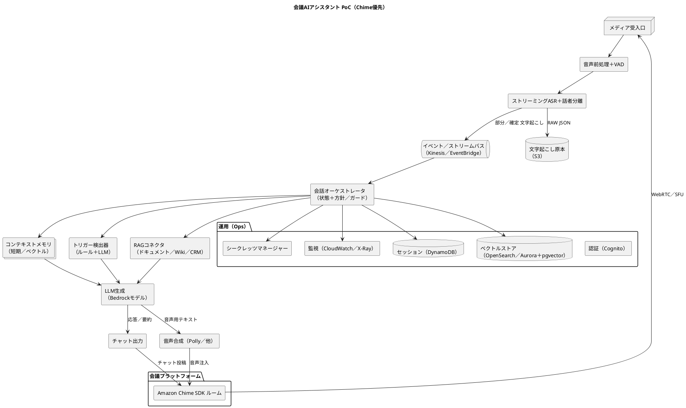

# アーキテクチャ

本PoCは Amazon Chime SDK を用いた会議ルームを前提とし、低遅延ストリーミングASR、連続理解（メモリ/トリガー検出）、LLMによる介入生成、チャット出力（優先）/任意の音声出力を実装する。L1のLLMは Amazon Bedrock 上のモデル群を主に利用する。

## システムコンポーネント構成図（PlantUML）

以下は上位アーキテクチャのコンポーネント図。会議プラットフォームはPoC段階で Chime SDK を利用し、将来的に Zoom/Teams/Meet のボット接続を拡張する。

## AWS中心の設計ポイント（PoC→拡張）
- 会議連携: 最小PoCは Chime SDK。後続で Zoom/Teams/Meet ボット連携（音声ルーティング/認可）を追加
- 音声→文字起こし: Amazon Transcribe Streaming（日本語、話者分離、カスタム語彙）
- イベント伝搬: Kinesis Data Streams（低遅延）または EventBridge（ルール/ファンアウト）
- オーケストレーション: 軽量常駐（ECS Fargate）または Step Functions Express
- LLM: Amazon Bedrock（Claude 3.7 Sonnet/Haiku、Cohere Command R、Llama/Mistral系）
- メモリ/RAG: DynamoDB（短期）、OpenSearch Serverless or Aurora pgvector（長期/検索）
- 出力: 会議チャット（Chime Messaging）、TTS（Polly/ElevenLabs）
- 運用: Cognito, CloudWatch Logs/Metrics/Alarms, X-Ray, Secrets Manager, KMS, S3

## リアルタイム性の目標
- E2E（発話終了→チャット表示）: 1.5–3.0秒
- 音声出力含む: 2.5–4.5秒
- 目標内訳: ASR 0.3–1.8s / LLM 0.3–3.5s / TTS 0.2–0.6s

## 主なリスクと対策
- ASR精度低下（雑音/重なり話者）
  - 対策: 近接マイク/チャネル分離、ノイズ抑制、カスタム語彙、モデル比較（Transcribe/Deepgram等）
- 過剰介入/誤介入
  - 対策: チャット優先、司会許可フロー、LLMスコア閾値調整、二段承認
- レイテンシ悪化
  - 対策: 低遅延モデル、同一リージョン、ストリーミング処理、計測/プロファイリング
- セキュリティ/同意/コンプラ
  - 対策: 明示表示、保持期間短縮、PIIマスキング、Bedrock Guardrails、最小権限IAM
- コスト不確実性
  - 対策: メトリクス収集、閾値ベースの節約（要約頻度/長さ制御）、モデル/ベンダ比較
